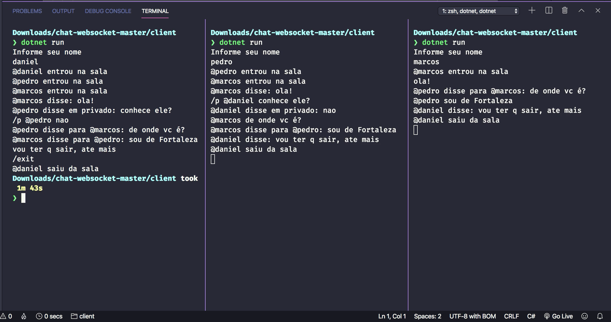

# Chat com WebSocket em C#




#### Como testar
> Você precisa do .NET Core 3.0 [https://dotnet.microsoft.com/download]


```
$ git clone https://github.com/DanAraujjo/chat-websocket
$ cd chat-websocket
$ cd server
$ dotnet restore
$ dotnet run
$ cd ..
$ cd client
$ dotnet restore
$ dotnet run
```
